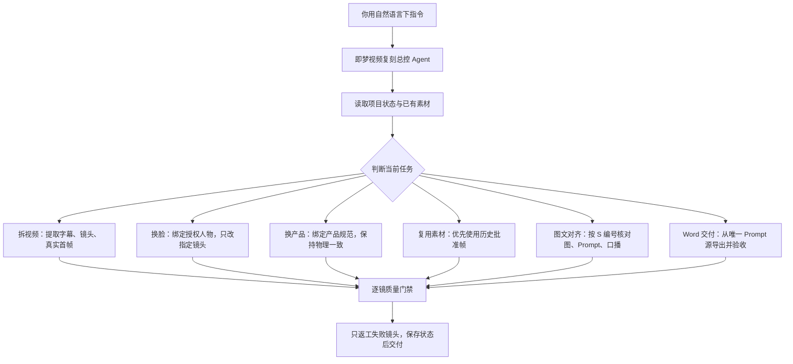

# 即梦视频复刻总控 Agent

总控 Agent 负责理解自然语言、读取项目状态并调度对应节点；实际的视频分析、换脸、换产品、图文对齐和 Word 导出仍由专用 Skill 与确定性脚本完成。

## 常用自然语言

- 完整复刻：`帮我复刻这个视频，把原产品替换为我提供的目标产品；先提取原字幕给我修改。`
- 继续任务：`继续上次的项目，读取进度，只做下一步。`
- 换脸：`把 S03、S05 换成男性1，服装、动作、背景和头发保持原视频。`
- 换产品：`把这些镜头里的原产品换成黄油脆丝棒，先复用已有批准产品图。`
- 图文检查：`检查一下图文有没有对齐，不要修改。`
- 图文对齐：`帮我对齐一下图文。`
- 导出 Word：`对齐图文并重新导出 Word，只修有问题的 S 编号。`
- 结果返工：`检查这个即梦结果，只返工产品结构或人物身份不合格的镜头。`

## 默认边界

- 不因为“继续”而整批重做。
- 不因为“对齐”而自动改 Prompt、换图或重新生图。
- 没有人物授权时不换脸。
- 有历史批准素材时优先复用，只补有理由的缺口。
- 各项目状态独立，多对话可以并行，不共用单一运行锁。
