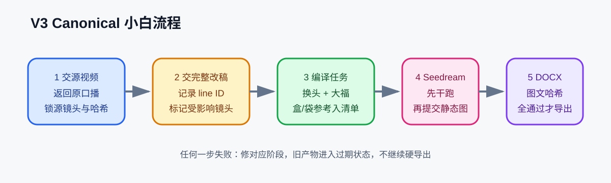
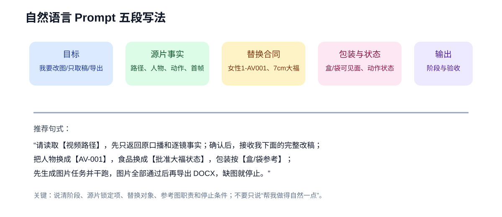
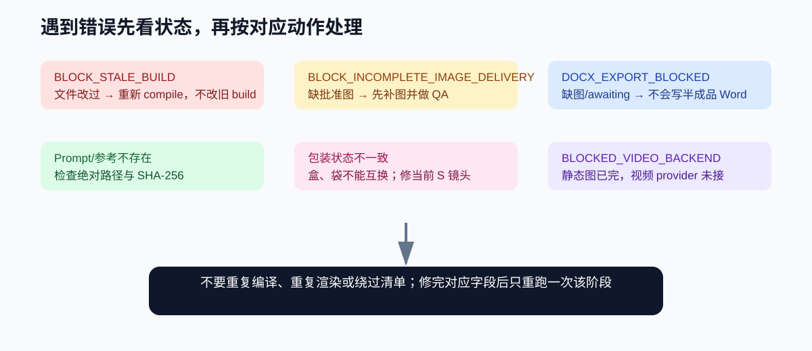

# V3 Canonical 小白操作教程

这份教程面向第一次使用视频改款系统的人。你不需要先学会写代码，但需要按顺序给出明确的自然语言指令。V3 的核心原则只有一句话：**先把原视频事实锁住，再把你的改稿和产品替换编译成可核对的任务，最后才生成图片、导出文档或提交视频。**

## 1. V3 到底负责什么

V3 把一条源视频整理成一套可追溯的改款项目包，主要负责：

1. 保留源视频的镜头数量、顺序、源帧、人物位置、手部职责和运镜事实。
2. 把原口播和字幕先交给你确认，再接收完整新版口播；改稿后会标出受影响的镜头，旧 Prompt 和旧图片自动失效。
3. 按批准的角色、产品、包装和参考图角色编译静态图任务。目标产品的尺寸、盒、独立袋、盘中数量和动作状态都从项目资料读取，不由系统临场臆想。
4. 使用 Seedream/火山引擎 Ark 生成或编辑静态图、首帧和局部替换图。先 `--dry-run`，再正式提交。
5. 只有当前口播、当前 Prompt、当前图片及哈希全部对齐，才允许导出 DOCX。

V3 **不会**把一个干跑结果冒充成已经生成的视频。视频提交需要单独配置、单独返回凭证和结果；如果视频后端不可用，状态会停在 `BLOCKED_VIDEO_BACKEND`，你应先解决后端，不要重复编译或反复导出文档。

源视频的转录仍属于源片 intake 阶段：V3 的 `source_handoff.py` 负责把已经得到的转录规范化并绑定源视频哈希。如果只有 MP4、还没有可靠转录，应先运行现有的源片转录/分析流程，再把结果交给 V3，不能凭记忆补台词。



## 2. 安装 V3

在仓库根目录执行：

```bash
python3 install.py --force
```

安装器会同时保留 V2 兼容目录，并安装 `video-remix-system-v3-canonical`。安装后重启 Codex，确保新 Skill 被重新加载。

如果你只想在仓库里测试，不必安装；下面的命令直接使用仓库中的 `skills/video-remix-system-v3-canonical/`。

## 3. 给系统的第一条自然语言指令

第一条指令只做源片 intake，不要同时要求生图、写 DOCX 或做视频。这样可以先确认镜头数量和排列，避免出现多出 S003/S009、漏掉 S011 或把原本纯手部镜头写成有人脸的错误。

可直接复制：

```text
请使用 V3 Canonical 读取源视频：/绝对路径/我的视频.mp4。
第一阶段只做 source intake：返回原口播和画面字幕、源镜头数量与顺序、每镜的起止时间、人物/画外声位置、手部职责、产品动作、可见源帧证据和源视频 SHA-256。
不要生成图片，不要编写最终 Prompt，不要导出 DOCX，不要新增 S 编号。
完成后停住，等我确认或提交完整新版口播。
```

你拿到 intake 后，要逐项核对：

- S 编号是否和原视频硬切/连续运镜一致；一张参考图不能凭空变成一个新镜头。
- 人物镜头是否确实看见头部和表情；纯手部、微距断面、纯产品镜头只能写手指、重量、包装摩擦、焦点和产品变化。
- 哪些镜头已有咬食、闭口咀嚼、双手掰开和拉丝；保留原片已有连续动作，不为凑数量拆出伪造镜头。
- 画外声和屏内口型是否有证据；没有证据就标注待确认，不把画外台词强行写成人物嘴型。

## 4. 交回完整新版口播

新版口播必须一次性给全，并保持句子顺序。不要只发“把第 4 句改一下”，因为系统需要重新计算每条 line ID 对哪些镜头产生影响。

可直接复制：

```text
这是完整新版口播，请按下面顺序替换旧稿：
1. ……
2. ……
3. ……

请先生成 revision impact：逐条列出 line ID、对应源镜头、屏内/画外声源、是否影响吃食或包装动作。
旧 Prompt、旧图片和旧 DOCX 不自动复用；等我确认 revision impact 后再重新编译。
```

如果只改了台词，仍要让系统检查画面证据。例如“产品馅料充足”要绑定已经形成的咬口或断面，不能让完整未破的产品凭空露馅；“三大盒”要绑定画面中确实出现的三盒包装。

## 5. 写产品替换指令：把事实写具体

产品指令建议按“人物/场景不变 → 产品规格 → 包装参考 → 动作状态 → 资产角色 → 输出阶段”写。不要只说“替换产品，做得自然一点”。

目标产品替换示例：

```text
在已锁定的源镜头和源帧上，将原食品替换为项目中批准的目标产品。
人物只使用知识库女性1-AV001；人物、身体、服装、手指、指甲、姿势、室内背景、机位、焦距、裁切、景深、光线和原有遮挡继续以源帧为事实。
产品尺寸、外观、材质、内馅和动作状态以项目中的产品规范与批准参考图为准；咬入口的画面先有外层受压，再出现符合该产品规范的局部咬口和短拉丝。
零售盒使用项目批准的零售盒参考，外尺寸、装量、排列、开口结构和内侧材质以该产品合同为准；取出或倒出前先完成合同规定的开口动作。
独立袋只使用项目批准的正面或侧面资产的包装形制；独立袋平放在桌面或被手承托，保持受力和接触阴影，不悬浮立起。
盘中产品使用项目批准的摆盘资产、排列和遮挡事实。只在源片已有的吃食、掰开、展示或包装区域替换对应产品，不新增人物、场景、机位或 S 编号。
先只编译 image_task_manifest 和 prompt_task_manifest，并返回每镜使用的参考资产、产品状态、包装状态和锁定区域；暂不提交 Seedream，不导出 DOCX。
```

### 人物镜头和非人物镜头怎么写

人物镜头只写原帧能看见的活人信息：视线至少两个落点或一次转移、眉峰/眼睑/嘴角等可观察微反应、肩线和重心变化、两只手各自承担什么、声音的起音/重音/尾音/吞音，以及这些变化如何推动下一步动作。情绪要和原因、强度、转折、落点一起写；“自然一点”“活人感强一点”本身不是可执行指令。

纯手部镜头只写拇指/食指受力、包装摩擦、重量变化、焦点移动和产品状态变化。微距断面只写断面、果泥黏连、冰皮厚度、手部承托、景深和材料反馈。没有人物的镜头不补脸部表情，也不凭空安排说话。

吃食镜头必须把不可逆事件拆开：送到嘴边 → 牙齿接触 → 局部咬口 → 拉丝 → 断开 → 产品离嘴 → 闭口咀嚼 → 恢复口型。双手掰开必须写受力凹陷、撕口形成、果泥随拉力变细、最薄处依次断开、两侧冰皮回弹和最终状态。每个 action beat 要有起止时码、动作触发、可见变化、声音变化、产品变化、镜头响应和下一动作；超过两秒继续拆分。



## 6. 编译、校验和 Seedream

推荐使用运行时自带的 Python：

```bash
PY=/Users/apple/.cache/codex-runtimes/codex-primary-runtime/dependencies/python/bin/python3
```

先自测：

```bash
"$PY" skills/video-remix-system-v3-canonical/scripts/self_test.py
"$PY" skills/video-remix-system-v3-canonical/scripts/test_export_docx_from_build.py
```

编译和校验：

```bash
"$PY" skills/video-remix-system-v3-canonical/scripts/canonical_pipeline.py \
  compile /绝对路径/canonical_project.json /绝对路径/build/v3

"$PY" skills/video-remix-system-v3-canonical/scripts/canonical_pipeline.py \
  validate /绝对路径/build/v3
```

Seedream 先干跑：

```bash
"$PY" skills/video-remix-system-v3-canonical/scripts/seedream_ark.py \
  submit /绝对路径/build/v3 /绝对路径/build/v3/seedream-dry-run.json --dry-run
```

干跑只证明任务清单、参考图、哈希和 provider 配置齐全，不会生成图片。确认清单无误且已设置 `ARK_API_KEY` 后，去掉 `--dry-run` 才会提交静态图任务。每一张返回图都要经过人工/自动 QA，并回写当前图像状态，不能把源帧截图当成已批准生成图。

## 7. 只从最新 build 导出 DOCX

```bash
"$PY" skills/video-remix-system-v3-canonical/scripts/export_docx_from_build.py \
  /绝对路径/build/v3 /绝对路径/output/v3-delivery.docx
```

导出器只消费同一 build 的五份 manifest。任一 selected S 镜头缺当前口播、当前 Prompt、批准/生成 QA 图、图像哈希或包装状态，都会阻断并且不写出半成品 DOCX。不要手动编辑 `script_shot_map` 后跳过重新编译；口播、Prompt、图像和 DOCX 必须来自同一个 build。

## 8. 常见状态和处理方法

| 状态 | 意思 | 正确处理 |
|---|---|---|
| `PASS` | 当前阶段通过 | 继续下一阶段，保留 build 路径 |
| `BLOCK_STALE_BUILD` | Prompt、脚本、源帧或参考图发生变化，旧 build 已过期 | 回到 source handoff/compile，重新生成受影响清单 |
| `BLOCK_INCOMPLETE_IMAGE_DELIVERY` | selected 镜头缺图、仍在等待生成或图哈希不对 | 完成 Seedream 提交和 QA，再重新导出；不拿源帧凑数 |
| `DOCX_EXPORT_BLOCKED` | 图文、口播、Prompt、包装或哈希无法逐镜对齐 | 先修对应 manifest，再导出，不手工拼接文档 |
| `BLOCKED_VIDEO_BACKEND` | 没有可用视频后端、凭证或返回结果 | 只保留静态图层和审计记录，配置后端后再单独提交视频 |



### 看到镜头数量错了

回到 source intake，重新对照原视频时间轴和源帧。不要因为有 13 张图片就写 13 个新镜头，也不要把 S003/S009 这类原片没有的编号塞进去。连续运镜仍是同一镜；原片已有第 4、5 次吃食，只要人物和产品状态连续，就保留。20 秒以上的补入事件要绑定既有源帧和既有 S 镜头，不能新建伪造镜头。

### 看到产品或包装错了

检查 `image_task_manifest` 的 `reference_assets`、`packaging_lock`、`product_state` 和几何指南。独立袋必须来自批准的 front/side 资产，桌面要有真实接触阴影；零售盒必须服从当前产品合同中的盒型和开口结构，不能被写成其他盒型。包装外尺寸与单颗产品尺寸必须按项目合同分开记录。

### 看到人物描述不像原片

先确认 shot mode。人物镜头引用源帧中的脸、身体方向、肩线、视线和手部职责；纯手部或微距镜头删掉脸部描写。然后把“活人感”改成可观察因果，例如“听到价格后眉峰先收紧，拇指停半拍确认盒面，抬眼回看镜头后的人，再把盒子推近”，而不是重复“很开心、很自然、很有感染力”。

### 看到口播和画面对不上

检查 line ID 是否每条只绑定一次、屏内/画外声源是否正确、台词是否有同期视觉证据。改稿后必须重新生成 revision impact 和完整 build；不能只替换 DOCX 文本，也不能在 Prompt 里重复塞一整份台词造成重复口播。

### 看到系统一直反复 QA

停止重复编译，保留最近一次错误状态。对照上表修对应阶段；如果是 `BLOCKED_VIDEO_BACKEND`，直接报告后端阻塞。如果用户只要阶段性交付，就交付当前 manifest/教程，不为了“看起来完成”生成 PDF 或半成品 DOCX。

## 9. 发布前检查清单

- [ ] V3 自测通过。
- [ ] source intake 绑定正确源视频 SHA-256，镜头数量和排列已确认。
- [ ] 完整新版口播已回写，revision impact 已检查。
- [ ] 每个 selected S 都有当前 Prompt、参考资产、产品/包装状态和源帧哈希。
- [ ] Seedream dry-run 通过；正式生成图已完成 QA 并回写哈希。
- [ ] stale Prompt、stale script map、缺图 DOCX 三类拦截测试仍然会阻断。
- [ ] 只有视频后端返回真实结果后，才把状态写成视频完成。

这套流程的目标不是多写文字，而是让“原片事实、替换产品、口播、图片和最终文档”始终能逐镜互相核对。遇到错误时，修产生错误的那一层，再从同一 build 重新向后走。
